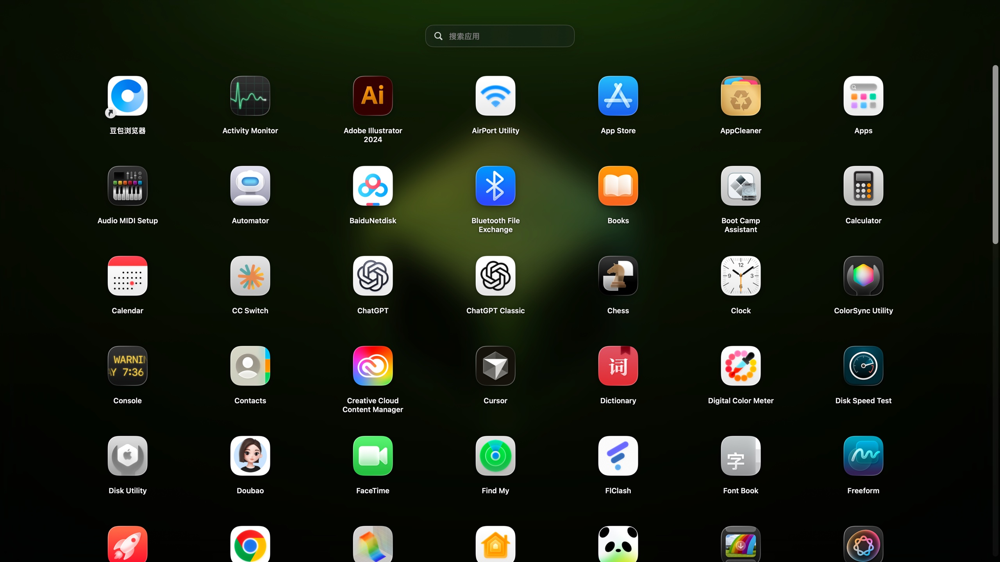

<div align="center">
  
  <h1>MacLaunch</h1>
  <p>把熟悉、顺滑的全屏应用启动台带回 macOS。</p>

  [](https://www.apple.com/macos/)
  [](https://www.swift.org/)
  [](LICENSE)
  [](https://github.com/ofocfc/MacLaunch/releases/latest)

  [官方网站](https://ofocfc.github.io/MacLaunch/) ·
  [下载最新版](https://github.com/ofocfc/MacLaunch/releases/latest/download/MacLaunch.zip) ·
  [问题反馈](https://github.com/ofocfc/MacLaunch/issues)
</div>



## MacLaunch 是什么

MacLaunch 是一款使用 SwiftUI、AppKit 和 Core Animation 编写的 macOS 应用启动台。它以桌面壁纸和毛玻璃效果作为背景，通过接近系统的图标布局、触控板翻页、拖动排序与应用文件夹，提供熟悉而直接的应用启动体验。

项目专注于本地使用：应用列表、布局和设置都保存在 Mac 上，不需要账号，也不会上传应用信息。

## 主要功能

- 桌面壁纸背景与动态模糊效果
- 自动避让菜单栏和程序坞，并随程序坞尺寸调整布局
- 根据屏幕、行数和列数自动计算图标尺寸与间距
- 支持触控板与鼠标滚轮的跟手翻页动画
- 首尾页边界限制与实时页面指示器
- 按应用原生名称实时搜索
- 点击应用后启动应用并隐藏启动台
- 点击空白区域或按 `Esc` 退出
- 拖动图标排序并自动补位
- 将多个应用组合为文件夹，支持拖入、拖出及文件夹重命名
- 自定义扫描应用文件夹、行数、列数和应用图标
- 自动保存应用顺序、文件夹结构和启动台设置

## 下载与使用

从 [Releases](https://github.com/ofocfc/MacLaunch/releases/latest) 下载 `MacLaunch.zip`：

1. 双击 ZIP 解压。
2. 将 `MacLaunch.app` 拖入“应用程序”文件夹。
3. 首次启动时右键应用，选择“打开”。

如果 macOS 仍然阻止启动，可以在终端执行：

```bash
xattr -dr com.apple.quarantine /Applications/MacLaunch.app
```

> 当前预编译版本使用本地临时签名，尚未进行 Apple Developer ID 签名和公证。

## 系统要求

- Apple 芯片 Mac（当前 Release 为 `arm64`）
- macOS 26.5 或更高版本

Intel Mac 和较旧 macOS 版本目前可以自行调整部署目标尝试编译，但不在预编译版本的支持范围内。

## 从源码构建

1. 克隆仓库：

   ```bash
   git clone https://github.com/ofocfc/MacLaunch.git
   cd MacLaunch
   ```

2. 使用 Xcode 打开 `MacLaunch.xcodeproj`。
3. 选择 `MacLaunch` Scheme 和 `My Mac`。
4. 点击 Run，或使用命令行构建：

   ```bash
   xcodebuild \
     -project MacLaunch.xcodeproj \
     -scheme MacLaunch \
     -configuration Debug \
     -destination 'platform=macOS' \
     build
   ```

## 项目结构

```text
MacLaunch/
├── MacLaunchApp.swift          # 应用生命周期与启动台窗口
├── ContentView.swift           # 应用扫描、搜索和主界面
├── CoreAnimationPager.swift    # 翻页、拖动与图标交互
├── LaunchpadLayout.swift       # 排序和文件夹数据
├── LauncherSettings.swift      # 设置界面与持久化
└── Assets.xcassets             # 图标与资源
docs/                           # GitHub Pages 宣传页
```

## 隐私

MacLaunch 在本机扫描用户指定的应用目录，并读取应用包中的名称与图标。项目不包含遥测、广告、登录或云端同步功能。

## 参与贡献

欢迎提交 Issue 和 Pull Request。提交代码前请先确认项目可以在 Xcode 中编译，并尽量保持交互方式与 macOS 原生体验一致。

## 开源许可

MacLaunch 使用 [MIT License](LICENSE) 开源。

macOS、Mac、Launchpad 和 Apple 是 Apple Inc. 的商标。本项目与 Apple Inc. 无关联，也未获得其认可。
